# UML del Sistema ISP (internet_online)

Este documento contiene el código PlantUML para generar diagramas que describen los flujos y funcionalidades principales del sistema ISP basado en PHP (MVC) con integración a routers MikroTik.


## 1) Diagrama de Casos de Uso

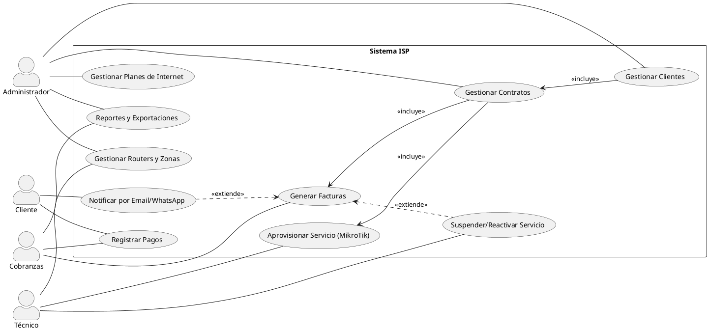


## 2) Diagramas de Secuencia

### 2.1 Diagrama_Secuencia_AltadeClienteyAprovisionamientodelServicio
Basado en Customers controller, services de red y Router API.

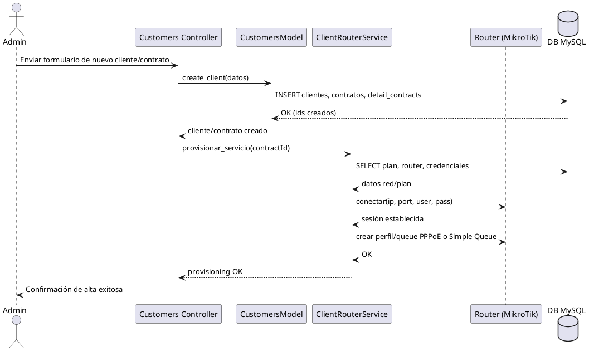

### 2.2 DiagramaSecuencia_GeneracióndeFacturas(Ciclo Mensual)
Basado en Bills y/o Cronjob.

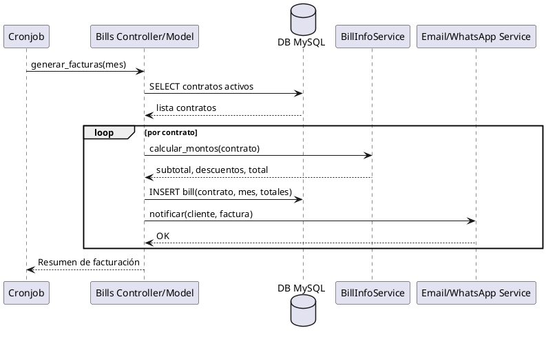

### 2.3 DiagramaSecuenca_RegistroPagodeFactura
Basado en Payments controller.

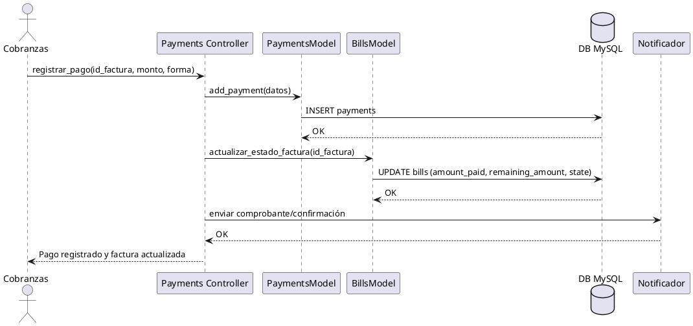


## 3) Diagramas de Actividad

### 3.1 Ciclo_de_Facturación_Mensual

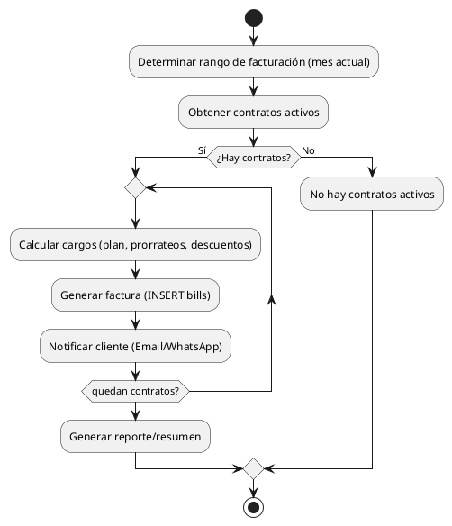

### 3.2 Actualización_de_Planes_en_Router(Internet->update_router_plans)

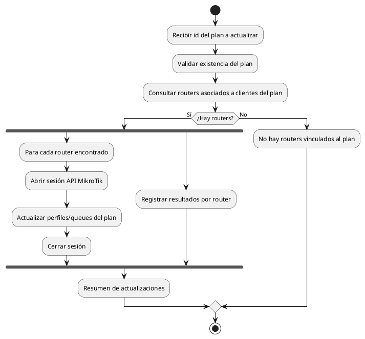


## 4) Diagramas Adicionales por Módulo

### 4.1 Diagrama de Casos de Uso: Sistema_de_Tickets_e_Incidencias

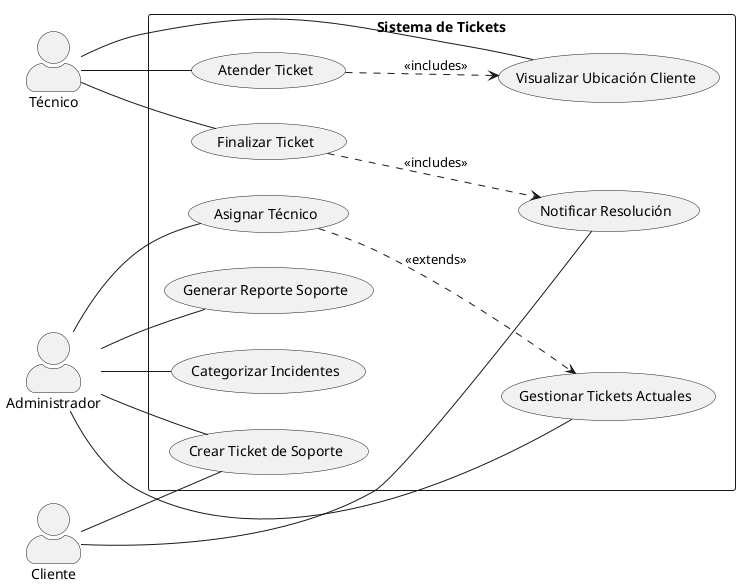

### 4.2 Diagrama de Secuencia: Proceso de Atención de Ticket

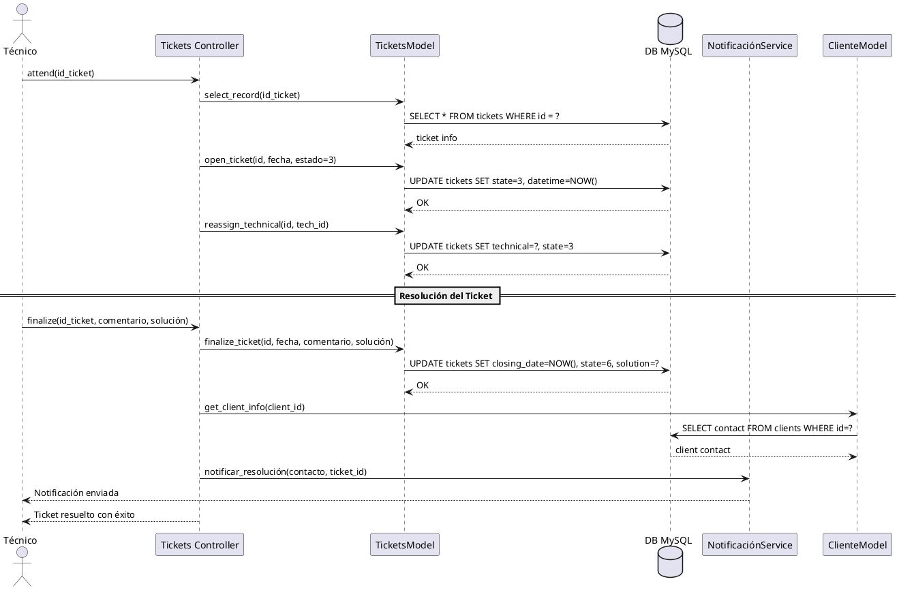

### 4.3 Diagrama de Actividad: Ciclo de Vida de una Instalación

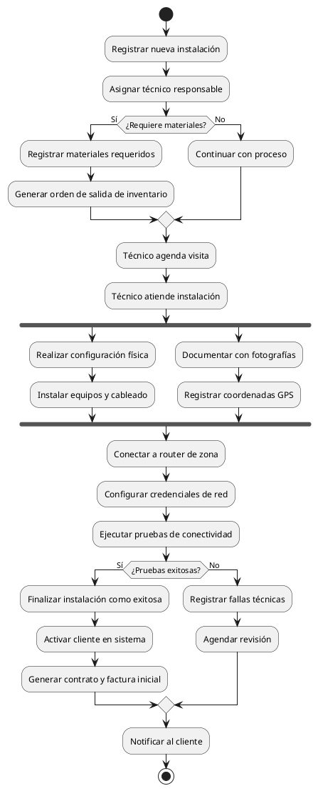

### 4.4 Diagrama de Secuencia: Monitoreo y Gestión de Routers

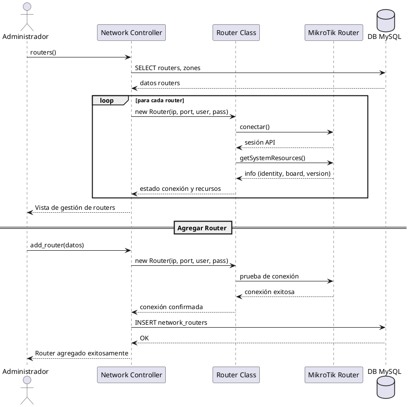

### 4.5 Diagrama de Actividad: Tarea Automatizada de Facturación

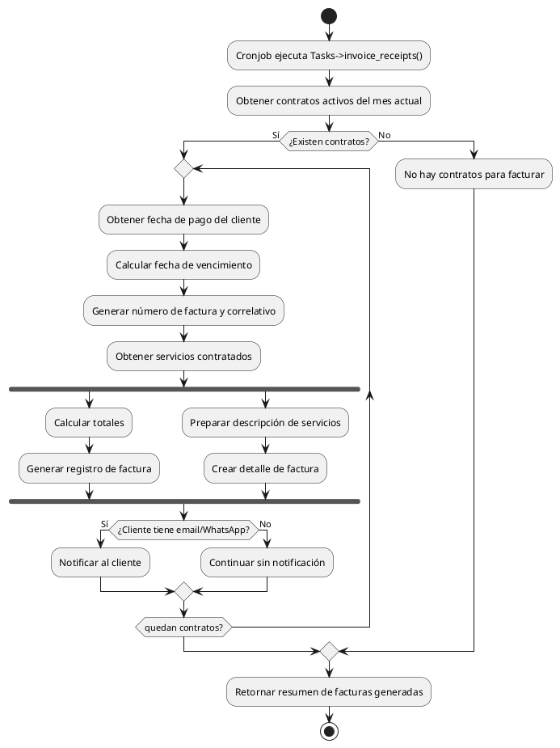

### 4.6 Diagrama de Secuencia: Gestión de Suspensión por Falta de Pago

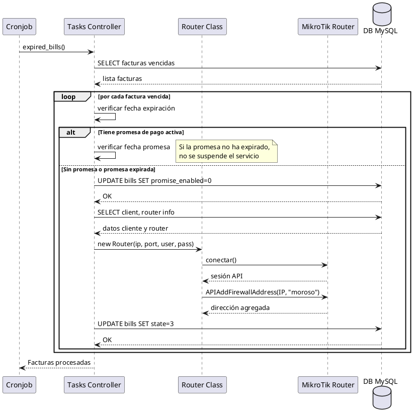

## 5) Diagramas de Casos de Uso Completos por Módulo

### 5.1 Diagrama_Casos_de_Uso_Gestión_de_Clientes

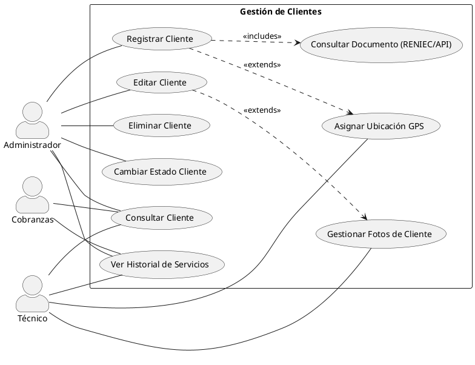

### 5.2 Diagrama_Casos_de_Uso_Gestión_de_Contratos

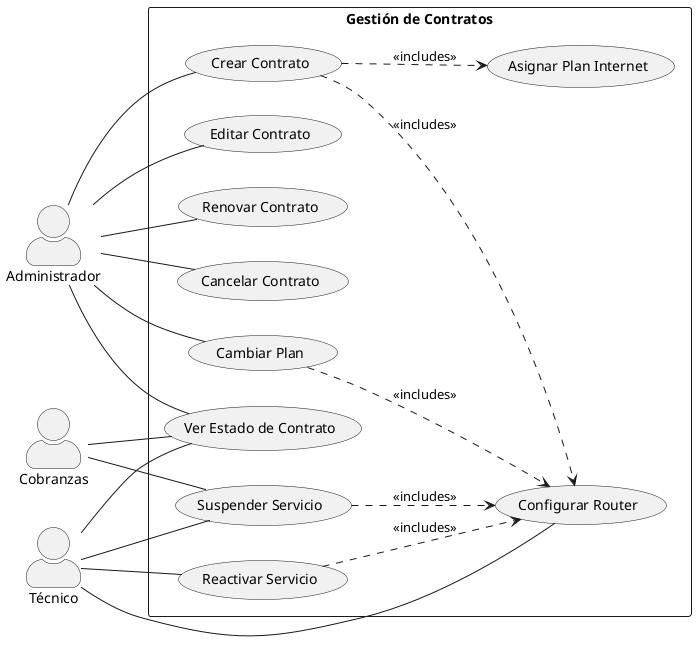

### 5.3 Diagrama_Casos_de_Uso_Gestión_Financiera

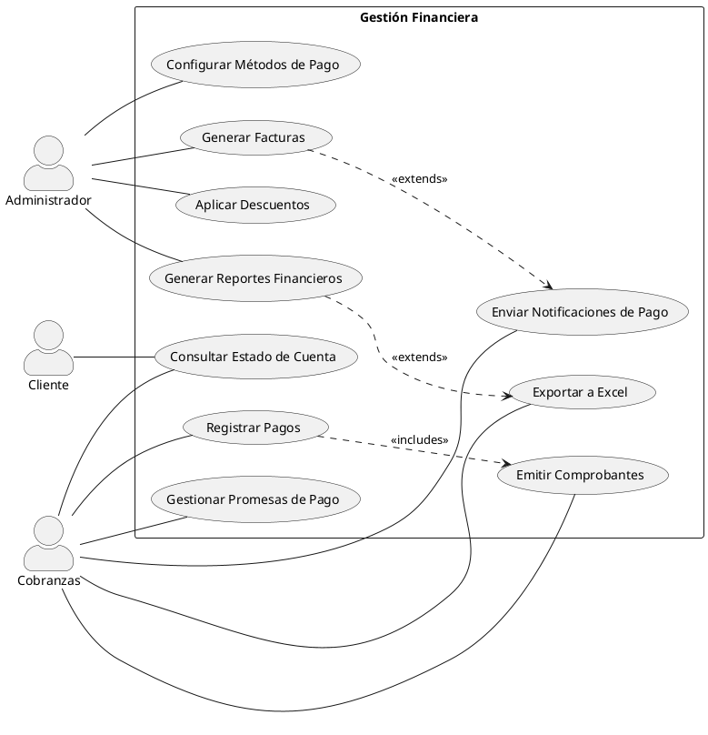

### 5.4 Diagrama_Casos_de_Uso_Gestión_de_Red

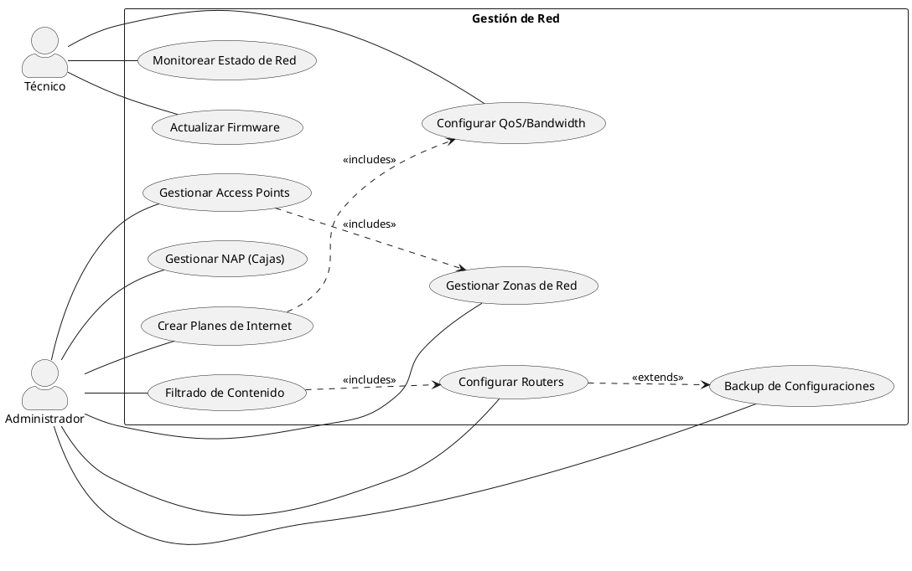

### 5.5 Diagrama_Casos_de_Uso_Sistema_de_Inventarios

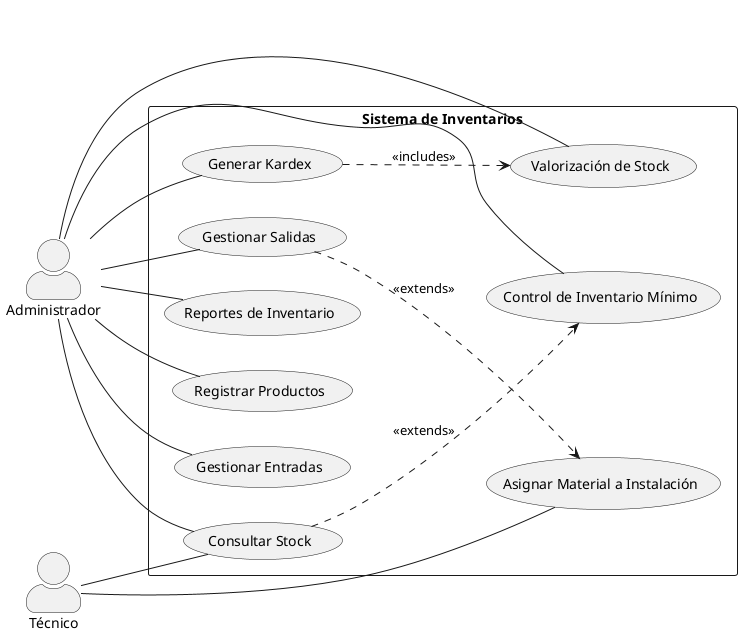

### 5.6 Diagrama_Casos_de_Uso_Comunicaciones

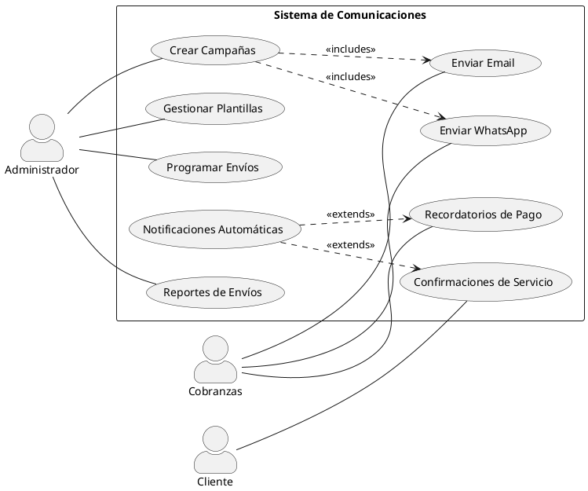

## 6) Diagramas de Secuencia Adicionales para Tickets e Incidencias

### 6.1 Diagrama_Secuencia_Creación_de_Ticket_por_Cliente

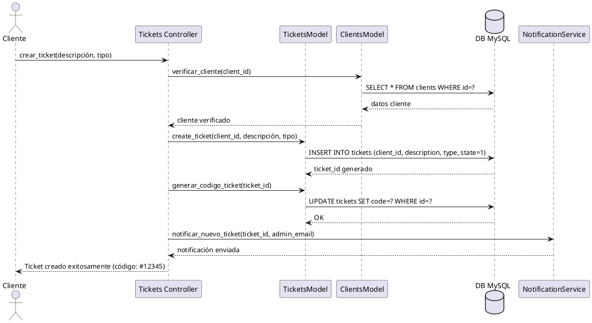

### 6.2 Diagrama_Secuencia_Asignación_Automática_de_Técnico

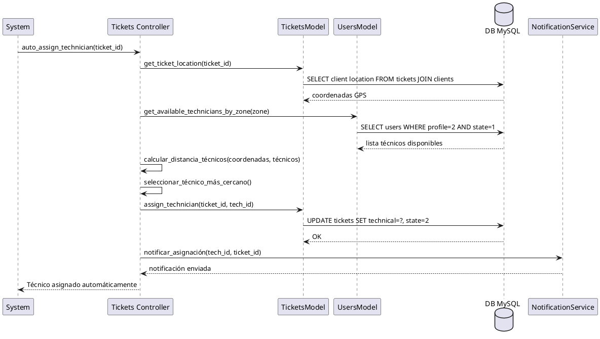

### 6.3 Diagrama_Actividad_Gestión_Completa_de_Incidencias

```plantuml
@startuml
start
:Incidencia reportada;
:Clasificar tipo de incidencia;

if (¿Es crítica?) then (Sí)
  :Prioridad ALTA;
  :Notificar inmediatamente;
else (No)
  :Prioridad NORMAL;
endif

:Identificar cliente afectado;
:Obtener ubicación GPS;
:Consultar historial técnico;
:Asignar técnico disponible;
:Notificar al técnico;

partition "Atención en Campo" {
  :Técnico atiende incidencia;
  :Diagnosticar problema;
  
  if (¿Requiere materiales?) then (Sí)
    :Solicitar materiales de inventario;
    :Esperar disponibilidad;
  else (No)
    :Continuar con reparación;
  endif
  
  :Implementar solución;
  :Probar funcionamiento;
  
  if (¿Solución exitosa?) then (Sí)
    :Documentar solución aplicada;
    :Tomar fotografías de evidencia;
    :Finalizar ticket;
    :Notificar resolución al cliente;
  else (No)
    :Escalar a técnico especializado;
    :Documentar intentos realizados;
    note right
      El ticket permanece abierto
      hasta resolución completa
    end note
  endif
}

:Actualizar base de conocimiento;
:Generar reporte de incidencia;
stop
@enduml
```

## Notas
- Los nombres de clases/participantes son representativos, alineados con los directorios Controllers, Models, Services y Libraries/MikroTik.
- Puedes copiar cualquier bloque y renderizarlo con tu extensión/servidor de PlantUML preferido.
- Estos diagramas complementan los principales y proporcionan una visión detallada de los módulos específicos del sistema ISP.

