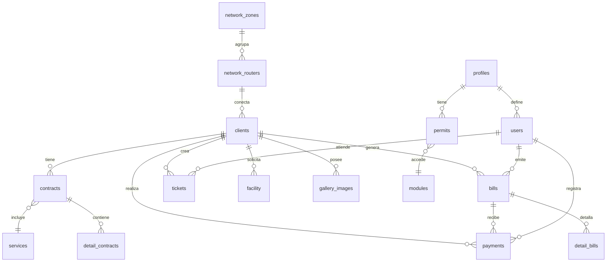

# 🗄️ Esquema de Base de Datos - Sistema WISP


## 📋 Tabla de Contenidos

- [Información General](#información-general)
- [Diagrama de Relaciones](#diagrama-de-relaciones)
- [Tablas del Sistema](#tablas-del-sistema)
  - [Gestión de Clientes](#gestión-de-clientes)
  - [Facturación y Pagos](#facturación-y-pagos)
  - [Red y Conectividad](#red-y-conectividad)
  - [Administración](#administración)
  - [Soporte y Tickets](#soporte-y-tickets)
  - [Inventario](#inventario)
  - [Configuración](#configuración)
- [Índices y Optimización](#índices-y-optimización)
- [Procedimientos Almacenados](#procedimientos-almacenados)
- [Triggers](#triggers)
- [Vistas](#vistas)

---

## 🔍 Información General

### Características de la Base de Datos
- **Motor**: MySQL 5.7+ / MariaDB 10.11+
- **Codificación**: UTF-8 (utf8mb4_spanish2_ci)
- **Motor de Almacenamiento**: InnoDB
- **Transacciones**: Soportadas
- **Claves Foráneas**: Implementadas
- **Backup**: Automatizado via cronjobs

### Configuración Recomendada
```sql
-- Configuración MySQL para WISP
[mysqld]
innodb_buffer_pool_size = 1G
innodb_log_file_size = 256M
max_connections = 200
query_cache_size = 64M
tmp_table_size = 64M
max_heap_table_size = 64M
```

---

## 📊 Diagrama de Relaciones



---

## 📋 Tablas del Sistema

### 👥 Gestión de Clientes

#### `clients` - Tabla Principal de Clientes
Almacena la información personal y de contacto de todos los clientes.

| Campo | Tipo | Descripción | Restricciones |
|-------|------|-------------|---------------|
| `id` | bigint(20) | ID único del cliente | PK, AUTO_INCREMENT |
| `names` | varchar(100) | Nombres del cliente | NOT NULL |
| `surnames` | varchar(100) | Apellidos del cliente | NOT NULL |
| `documentid` | bigint(20) | Tipo de documento | FK → document_type |
| `document` | varchar(15) | Número de documento | NOT NULL, UNIQUE |
| `mobile` | varchar(10) | Teléfono principal | NOT NULL |
| `mobile_optional` | varchar(10) | Teléfono secundario | NULL |
| `email` | varchar(100) | Correo electrónico | NULL |
| `address` | text | Dirección completa | NOT NULL |
| `reference` | text | Referencia de ubicación | NULL |
| `note` | varchar(255) | Notas adicionales | NULL |
| `latitud` | varchar(50) | Coordenada latitud | NOT NULL |
| `longitud` | varchar(50) | Coordenada longitud | NOT NULL |
| `state` | bigint(20) | Estado del cliente | DEFAULT 1 |
| `net_router` | int(11) | Router asignado | FK → network_routers |
| `net_name` | varchar(128) | Usuario de red | NOT NULL |
| `net_password` | varchar(128) | Contraseña de red (encriptada) | NOT NULL |
| `net_localaddress` | varchar(64) | IP local asignada | NULL |
| `net_ip` | varchar(64) | IP pública | NULL |
| `nap_cliente_id` | int(11) | Puerto NAP asignado | FK → caja_nap_clientes |
| `ap_cliente_id` | int(11) | Antena asignada | FK → ap_clientes |
| `zonaid` | bigint(20) | Zona de cobertura | FK → network_zones |

**Estados de Cliente:**
- `1`: Activo
- `2`: Suspendido
- `3`: Cortado
- `4`: Inactivo

#### `contracts` - Contratos de Servicio
Define los términos contractuales de cada cliente.

| Campo | Tipo | Descripción | Restricciones |
|-------|------|-------------|---------------|
| `id` | bigint(20) | ID único del contrato | PK, AUTO_INCREMENT |
| `userid` | bigint(20) | Usuario que creó el contrato | FK → users |
| `clientid` | bigint(20) | Cliente asociado | FK → clients |
| `internal_code` | varchar(50) | Código interno del contrato | NOT NULL, UNIQUE |
| `payday` | bigint(20) | Día de pago (1-31) | NOT NULL |
| `create_invoice` | bigint(20) | Auto-generar facturas | DEFAULT 0 |
| `days_grace` | bigint(20) | Días de gracia | DEFAULT 0 |
| `discount` | bigint(20) | Porcentaje de descuento | DEFAULT 0 |
| `discount_price` | decimal(12,2) | Monto de descuento | DEFAULT 0.00 |
| `months_discount` | bigint(20) | Meses con descuento | DEFAULT 0 |
| `remaining_discount` | bigint(20) | Meses restantes de descuento | DEFAULT 0 |
| `contract_date` | datetime | Fecha de contrato | NOT NULL |
| `suspension_date` | date | Fecha de suspensión | NULL |
| `finish_date` | date | Fecha de finalización | NULL |
| `state` | bigint(20) | Estado del contrato | NOT NULL |

**Estados de Contrato:**
- `1`: Borrador
- `2`: Activo
- `3`: Suspendido
- `4`: Finalizado

#### `detail_contracts` - Servicios del Contrato
Detalla los servicios incluidos en cada contrato.

| Campo | Tipo | Descripción | Restricciones |
|-------|------|-------------|---------------|
| `id` | bigint(20) | ID único | PK, AUTO_INCREMENT |
| `contractid` | bigint(20) | Contrato asociado | FK → contracts |
| `serviceid` | bigint(20) | Servicio contratado | FK → services |
| `price` | decimal(12,2) | Precio del servicio | NOT NULL |
| `registration_date` | datetime | Fecha de registro | NOT NULL |
| `state` | bigint(20) | Estado del servicio | DEFAULT 1 |

---

### 💰 Facturación y Pagos

#### `bills` - Facturas
Registro de todas las facturas emitidas.

| Campo | Tipo | Descripción | Restricciones |
|-------|------|-------------|---------------|
| `id` | bigint(20) | ID único de la factura | PK, AUTO_INCREMENT |
| `userid` | bigint(20) | Usuario que emitió | FK → users |
| `clientid` | bigint(20) | Cliente facturado | FK → clients |
| `voucherid` | bigint(20) | Tipo de comprobante | FK → vouchers |
| `serieid` | bigint(20) | Serie del comprobante | FK → series |
| `internal_code` | varchar(50) | Código interno | NOT NULL, UNIQUE |
| `correlative` | bigint(20) | Número correlativo | NOT NULL |
| `date_issue` | date | Fecha de emisión | NOT NULL |
| `expiration_date` | date | Fecha de vencimiento | NOT NULL |
| `billed_month` | date | Mes facturado | NOT NULL |
| `subtotal` | decimal(12,2) | Subtotal | NOT NULL |
| `discount` | decimal(12,2) | Descuento aplicado | DEFAULT 0.00 |
| `total` | decimal(12,2) | Total de la factura | NOT NULL |
| `amount_paid` | decimal(12,2) | Monto pagado | DEFAULT 0.00 |
| `remaining_amount` | decimal(12,2) | Saldo pendiente | DEFAULT 0.00 |
| `type` | bigint(20) | Tipo de factura | NOT NULL |
| `sales_method` | bigint(20) | Método de venta | NOT NULL |
| `observation` | text | Observaciones | NULL |
| `promise_enabled` | tinyint(4) | Promesa de pago habilitada | DEFAULT 0 |
| `promise_date` | date | Fecha de promesa | NULL |
| `promise_set_date` | date | Fecha cuando se hizo la promesa | NULL |
| `promise_comment` | varchar(512) | Comentario de promesa | NULL |
| `state` | bigint(20) | Estado de la factura | DEFAULT 2 |
| `compromise_date` | date | Fecha de compromiso | NULL |

**Tipos de Factura:**
- `1`: Venta directa
- `2`: Servicio mensual

**Estados de Factura:**
- `1`: Pagada
- `2`: Pendiente
- `3`: Vencida
- `4`: Anulada

#### `detail_bills` - Detalle de Facturas
Líneas de detalle de cada factura.

| Campo | Tipo | Descripción | Restricciones |
|-------|------|-------------|---------------|
| `id` | bigint(20) | ID único | PK, AUTO_INCREMENT |
| `billid` | bigint(20) | Factura asociada | FK → bills |
| `type` | bigint(20) | Tipo de ítem | NOT NULL |
| `serproid` | bigint(20) | ID del servicio/producto | NOT NULL |
| `description` | text | Descripción del ítem | NOT NULL |
| `quantity` | bigint(20) | Cantidad | NOT NULL |
| `price` | decimal(12,2) | Precio unitario | NOT NULL |
| `total` | decimal(12,2) | Total de la línea | NOT NULL |

#### `payments` - Pagos
Registro de todos los pagos recibidos.

| Campo | Tipo | Descripción | Restricciones |
|-------|------|-------------|---------------|
| `id` | bigint(20) | ID único del pago | PK, AUTO_INCREMENT |
| `billid` | bigint(20) | Factura pagada | FK → bills |
| `userid` | bigint(20) | Usuario que registró | FK → users |
| `clientid` | bigint(20) | Cliente que pagó | FK → clients |
| `internal_code` | varchar(50) | Código interno | NOT NULL, UNIQUE |
| `paytypeid` | bigint(20) | Forma de pago | FK → forms_payment |
| `payment_date` | datetime | Fecha del pago | NOT NULL |
| `comment` | text | Comentarios | NULL |
| `amount_paid` | decimal(12,2) | Monto pagado | NOT NULL |
| `amount_total` | decimal(12,2) | Monto total de la factura | DEFAULT 0.00 |
| `remaining_credit` | decimal(12,2) | Crédito restante | DEFAULT 0.00 |
| `state` | bigint(20) | Estado del pago | DEFAULT 1 |
| `ticket_number` | varchar(255) | Número de ticket | NULL |
| `reference_number` | varchar(255) | Número de referencia | NULL |

**Estados de Pago:**
- `0`: Anulado
- `1`: Confirmado
- `2`: Pendiente

#### `forms_payment` - Formas de Pago
Métodos de pago disponibles.

| Campo | Tipo | Descripción | Restricciones |
|-------|------|-------------|---------------|
| `id` | bigint(20) | ID único | PK, AUTO_INCREMENT |
| `payment_type` | varchar(500) | Nombre del método | NOT NULL |
| `registration_date` | datetime | Fecha de registro | NOT NULL |
| `state` | bigint(20) | Estado | DEFAULT 1 |

---

### 🌐 Red y Conectividad

#### `network_routers` - Routers de Red
Equipos de red MikroTik configurados.

| Campo | Tipo | Descripción | Restricciones |
|-------|------|-------------|---------------|
| `id` | int(11) | ID único del router | PK, AUTO_INCREMENT |
| `name` | varchar(64) | Nombre del router | NOT NULL |
| `ip` | varchar(256) | Dirección IP | NOT NULL |
| `port` | int(11) | Puerto de API | NOT NULL |
| `username` | varchar(64) | Usuario de acceso | NOT NULL |
| `password` | varchar(128) | Contraseña (encriptada) | NOT NULL |
| `ip_range` | varchar(128) | Rango de IPs | NOT NULL |
| `zoneid` | int(11) | Zona de cobertura | FK → network_zones |
| `identity` | varchar(256) | Identidad del router | NULL |
| `board_name` | varchar(256) | Nombre de la placa | NULL |
| `version` | varchar(64) | Versión de RouterOS | NULL |
| `status` | varchar(64) | Estado de conexión | NULL |

#### `network_zones` - Zonas de Red
Agrupación lógica de routers por zona geográfica.

| Campo | Tipo | Descripción | Restricciones |
|-------|------|-------------|---------------|
| `id` | int(11) | ID único de la zona | PK, AUTO_INCREMENT |
| `name` | varchar(64) | Nombre de la zona | NOT NULL |
| `mode` | tinyint(4) | Modo de operación | NOT NULL |

**Modos de Zona:**
- `1`: Simple Queues
- `2`: PPPoE

#### `caja_nap` - Cajas NAP/MUFA
Infraestructura de fibra óptica.

| Campo | Tipo | Descripción | Restricciones |
|-------|------|-------------|---------------|
| `id` | int(11) | ID único | PK, AUTO_INCREMENT |
| `nombre` | varchar(100) | Nombre de la caja | NOT NULL |
| `longitud` | varchar(100) | Coordenada longitud | NOT NULL |
| `latitud` | varchar(100) | Coordenada latitud | NOT NULL |
| `puertos` | int(11) | Número de puertos | NOT NULL |
| `detalles` | varchar(100) | Detalles adicionales | NOT NULL |
| `ubicacion` | varchar(100) | Descripción de ubicación | NULL |
| `tipo` | varchar(100) | Tipo de caja | DEFAULT 'nap' |
| `color_tubo` | varchar(100) | Color del tubo | NULL |
| `color_hilo` | varchar(100) | Color del hilo | NULL |
| `zonaId` | int(11) | Zona asignada | FK → network_zones |

**Tipos de Caja:**
- `nap`: Caja NAP
- `mufa`: Caja MUFA

#### `caja_nap_clientes` - Asignación de Puertos
Relación entre clientes y puertos de fibra.

| Campo | Tipo | Descripción | Restricciones |
|-------|------|-------------|---------------|
| `id` | int(11) | ID único | PK, AUTO_INCREMENT |
| `cliente_id` | int(11) | Cliente asignado | FK → clients |
| `nap_id` | int(11) | Caja NAP | FK → caja_nap |
| `puerto` | varchar(100) | Número de puerto | NOT NULL |

#### `ap_clientes` - Antenas Cliente
Equipos de radio en casa del cliente.

| Campo | Tipo | Descripción | Restricciones |
|-------|------|-------------|---------------|
| `id` | int(11) | ID único | PK, AUTO_INCREMENT |
| `nombre` | varchar(100) | Nombre de la antena | NOT NULL |
| `ip` | varchar(100) | Dirección IP | NULL |
| `version` | varchar(100) | Versión del firmware | NULL |

---

### 👨‍💼 Administración

#### `users` - Usuarios del Sistema
Personal autorizado para usar el sistema.

| Campo | Tipo | Descripción | Restricciones |
|-------|------|-------------|---------------|
| `id` | bigint(20) | ID único del usuario | PK, AUTO_INCREMENT |
| `profileid` | bigint(20) | Perfil asignado | FK → profiles |
| `names` | varchar(100) | Nombres | NOT NULL |
| `surnames` | varchar(100) | Apellidos | NOT NULL |
| `documentid` | bigint(20) | Tipo de documento | FK → document_type |
| `document` | varchar(15) | Número de documento | NOT NULL, UNIQUE |
| `mobile` | varchar(10) | Teléfono | NOT NULL |
| `email` | varchar(100) | Correo electrónico | NOT NULL, UNIQUE |
| `username` | varchar(50) | Nombre de usuario | NOT NULL, UNIQUE |
| `password` | varchar(128) | Contraseña (hash) | NOT NULL |
| `registration_date` | datetime | Fecha de registro | NOT NULL |
| `state` | bigint(20) | Estado del usuario | DEFAULT 1 |

#### `profiles` - Perfiles de Usuario
Roles y niveles de acceso.

| Campo | Tipo | Descripción | Restricciones |
|-------|------|-------------|---------------|
| `id` | bigint(20) | ID único del perfil | PK, AUTO_INCREMENT |
| `profile` | varchar(100) | Nombre del perfil | NOT NULL |
| `registration_date` | datetime | Fecha de creación | NOT NULL |
| `state` | bigint(20) | Estado | DEFAULT 1 |

#### `permits` - Permisos
Matriz de permisos por perfil y módulo.

| Campo | Tipo | Descripción | Restricciones |
|-------|------|-------------|---------------|
| `id` | bigint(20) | ID único | PK, AUTO_INCREMENT |
| `profileid` | bigint(20) | Perfil | FK → profiles |
| `moduleid` | bigint(20) | Módulo | FK → modules |
| `r` | bigint(20) | Permiso de lectura | DEFAULT 0 |
| `a` | bigint(20) | Permiso de creación | DEFAULT 0 |
| `e` | bigint(20) | Permiso de edición | DEFAULT 0 |
| `v` | bigint(20) | Permiso de eliminación | DEFAULT 0 |

#### `modules` - Módulos del Sistema
Funcionalidades disponibles en el sistema.

| Campo | Tipo | Descripción | Restricciones |
|-------|------|-------------|---------------|
| `id` | bigint(20) | ID único del módulo | PK, AUTO_INCREMENT |
| `module` | varchar(100) | Nombre del módulo | NOT NULL |
| `state` | bigint(20) | Estado | DEFAULT 1 |

---

### 🎫 Soporte y Tickets

#### `tickets` - Tickets de Soporte
Sistema de atención al cliente.

| Campo | Tipo | Descripción | Restricciones |
|-------|------|-------------|---------------|
| `id` | bigint(20) | ID único del ticket | PK, AUTO_INCREMENT |
| `clientid` | bigint(20) | Cliente que reporta | FK → clients |
| `userid` | bigint(20) | Usuario asignado | FK → users |
| `technicalid` | bigint(20) | Técnico asignado | FK → technicals |
| `incidentid` | bigint(20) | Tipo de incidencia | FK → incidents |
| `internal_code` | varchar(50) | Código interno | NOT NULL, UNIQUE |
| `attention_date` | datetime | Fecha de atención | NOT NULL |
| `opening_date` | datetime | Fecha de apertura | NOT NULL |
| `closing_date` | datetime | Fecha de cierre | NULL |
| `detail` | text | Descripción del problema | NOT NULL |
| `solution` | text | Solución aplicada | NULL |
| `registration_date` | datetime | Fecha de registro | NOT NULL |
| `state` | bigint(20) | Estado del ticket | DEFAULT 2 |

**Estados de Ticket:**
- `1`: Cerrado
- `2`: Abierto
- `3`: En proceso
- `4`: Pendiente

#### `incidents` - Tipos de Incidencias
Catálogo de problemas comunes.

| Campo | Tipo | Descripción | Restricciones |
|-------|------|-------------|---------------|
| `id` | bigint(20) | ID único | PK, AUTO_INCREMENT |
| `incident` | varchar(500) | Descripción de la incidencia | NOT NULL |
| `registration_date` | datetime | Fecha de registro | NOT NULL |
| `state` | bigint(20) | Estado | DEFAULT 1 |

#### `technicals` - Técnicos
Personal técnico para atención de tickets.

| Campo | Tipo | Descripción | Restricciones |
|-------|------|-------------|---------------|
| `id` | bigint(20) | ID único | PK, AUTO_INCREMENT |
| `names` | varchar(100) | Nombres | NOT NULL |
| `surnames` | varchar(100) | Apellidos | NOT NULL |
| `mobile` | varchar(10) | Teléfono | NOT NULL |
| `email` | varchar(100) | Correo electrónico | NULL |
| `registration_date` | datetime | Fecha de registro | NOT NULL |
| `state` | bigint(20) | Estado | DEFAULT 1 |

---

### 🔧 Instalaciones

#### `facility` - Instalaciones
Registro de instalaciones realizadas.

| Campo | Tipo | Descripción | Restricciones |
|-------|------|-------------|---------------|
| `id` | bigint(20) | ID único | PK, AUTO_INCREMENT |
| `clientid` | bigint(20) | Cliente | FK → clients |
| `userid` | bigint(20) | Usuario que registra | FK → users |
| `technical` | bigint(20) | Técnico asignado | FK → technicals |
| `attention_date` | datetime | Fecha programada | NOT NULL |
| `opening_date` | datetime | Inicio de instalación | NOT NULL |
| `closing_date` | datetime | Fin de instalación | NOT NULL |
| `cost` | decimal(12,2) | Costo de instalación | DEFAULT 0.00 |
| `detail` | text | Detalles de la instalación | NULL |
| `registration_date` | datetime | Fecha de registro | NOT NULL |
| `state` | bigint(20) | Estado | DEFAULT 2 |

#### `detail_facility` - Detalle de Instalaciones
Información técnica de cada instalación.

| Campo | Tipo | Descripción | Restricciones |
|-------|------|-------------|---------------|
| `id` | bigint(20) | ID único | PK, AUTO_INCREMENT |
| `facilityid` | bigint(20) | Instalación | FK → facility |
| `technicalid` | bigint(20) | Técnico | FK → technicals |
| `opening_date` | datetime | Inicio del trabajo | NOT NULL |
| `closing_date` | datetime | Fin del trabajo | NOT NULL |
| `comment` | text | Comentarios técnicos | NULL |
| `state` | bigint(20) | Estado | NOT NULL |
| `red_type` | varchar(255) | Tipo de red instalada | NULL |

---

### 📦 Inventario

#### `products` - Productos
Catálogo de productos y equipos.

| Campo | Tipo | Descripción | Restricciones |
|-------|------|-------------|---------------|
| `id` | bigint(20) | ID único | PK, AUTO_INCREMENT |
| `categoryid` | bigint(20) | Categoría | FK → categories |
| `supplierid` | bigint(20) | Proveedor | FK → suppliers |
| `unitid` | bigint(20) | Unidad de medida | FK → units |
| `product` | varchar(200) | Nombre del producto | NOT NULL |
| `description` | text | Descripción | NULL |
| `purchase_price` | decimal(12,2) | Precio de compra | DEFAULT 0.00 |
| `sale_price` | decimal(12,2) | Precio de venta | DEFAULT 0.00 |
| `stock` | bigint(20) | Stock actual | DEFAULT 0 |
| `min_stock` | bigint(20) | Stock mínimo | DEFAULT 0 |
| `registration_date` | datetime | Fecha de registro | NOT NULL |
| `state` | bigint(20) | Estado | DEFAULT 1 |

#### `categories` - Categorías de Productos
Clasificación de productos.

| Campo | Tipo | Descripción | Restricciones |
|-------|------|-------------|---------------|
| `id` | bigint(20) | ID único | PK, AUTO_INCREMENT |
| `category` | varchar(100) | Nombre de la categoría | NOT NULL |
| `registration_date` | datetime | Fecha de registro | NOT NULL |
| `state` | bigint(20) | Estado | DEFAULT 1 |

#### `suppliers` - Proveedores
Proveedores de equipos y servicios.

| Campo | Tipo | Descripción | Restricciones |
|-------|------|-------------|---------------|
| `id` | bigint(20) | ID único | PK, AUTO_INCREMENT |
| `documentid` | bigint(20) | Tipo de documento | FK → document_type |
| `document` | varchar(15) | Número de documento | NOT NULL |
| `supplier` | varchar(200) | Nombre del proveedor | NOT NULL |
| `mobile` | varchar(10) | Teléfono | NOT NULL |
| `email` | varchar(100) | Correo electrónico | NULL |
| `address` | text | Dirección | NULL |
| `registration_date` | datetime | Fecha de registro | NOT NULL |
| `state` | bigint(20) | Estado | DEFAULT 1 |

---

### ⚙️ Configuración

#### `business` - Configuración de Empresa
Datos de la empresa y configuración general.

| Campo | Tipo | Descripción | Restricciones |
|-------|------|-------------|---------------|
| `id` | bigint(20) | ID único | PK, AUTO_INCREMENT |
| `documentid` | bigint(20) | Tipo de documento | FK → document_type |
| `ruc` | char(11) | RUC/NIT de la empresa | NOT NULL |
| `business_name` | varchar(100) | Razón social | NOT NULL |
| `tradename` | varchar(100) | Nombre comercial | NOT NULL |
| `slogan` | text | Eslogan | NULL |
| `mobile` | varchar(10) | Teléfono principal | NOT NULL |
| `mobile_refrence` | varchar(10) | Teléfono de referencia | NULL |
| `email` | varchar(200) | Correo corporativo | NOT NULL |
| `password` | varchar(200) | Contraseña de correo | NULL |
| `server_host` | varchar(200) | Servidor de correo | NULL |
| `port` | varchar(50) | Puerto SMTP | NULL |
| `address` | text | Dirección fiscal | NOT NULL |
| `department` | varchar(100) | Departamento | NOT NULL |
| `province` | varchar(100) | Provincia | NOT NULL |
| `district` | varchar(100) | Distrito | NOT NULL |
| `ubigeo` | char(6) | Código UBIGEO | NOT NULL |
| `footer_text` | text | Texto de pie de página | NULL |
| `currencyid` | bigint(20) | Moneda principal | FK → currency |
| `print_format` | varchar(100) | Formato de impresión | NOT NULL |
| `logotyope` | varchar(200) | Logo principal | NULL |
| `logo_login` | varchar(200) | Logo de login | NULL |
| `logo_email` | varchar(1000) | Logo para emails | NULL |
| `favicon` | varchar(200) | Favicon | NULL |
| `country_code` | varchar(20) | Código de país | NOT NULL |
| `google_apikey` | text | API Key de Google | NULL |
| `reniec_apikey` | text | API Key de RENIEC | NULL |
| `background` | varchar(100) | Imagen de fondo | NULL |
| `whatsapp_api` | varchar(100) | API de WhatsApp | NULL |
| `whatsapp_key` | varchar(100) | Key de WhatsApp | NULL |

#### `currency` - Monedas
Configuración de monedas soportadas.

| Campo | Tipo | Descripción | Restricciones |
|-------|------|-------------|---------------|
| `id` | bigint(20) | ID único | PK, AUTO_INCREMENT |
| `currency_iso` | varchar(3) | Código ISO | NOT NULL |
| `language` | varchar(3) | Idioma | NOT NULL |
| `currency_name` | varchar(50) | Nombre de la moneda | NOT NULL |
| `money` | varchar(30) | Singular | NOT NULL |
| `money_plural` | varchar(50) | Plural | NOT NULL |
| `symbol` | varchar(3) | Símbolo | NOT NULL |
| `registration_date` | datetime | Fecha de registro | NOT NULL |
| `state` | bigint(20) | Estado | DEFAULT 1 |

#### `document_type` - Tipos de Documento
Tipos de documentos de identidad.

| Campo | Tipo | Descripción | Restricciones |
|-------|------|-------------|---------------|
| `id` | bigint(20) | ID único | PK, AUTO_INCREMENT |
| `document` | varchar(100) | Nombre del documento | NOT NULL |
| `maxlength` | int(2) | Longitud máxima | DEFAULT 8 |
| `is_required` | tinyint(1) | Es requerido | DEFAULT 1 |

---

### 🤖 Automatización

#### `cronjobs` - Tareas Programadas
Configuración de tareas automáticas.

| Campo | Tipo | Descripción | Restricciones |
|-------|------|-------------|---------------|
| `id` | int(11) | ID único | PK, AUTO_INCREMENT |
| `description` | varchar(256) | Descripción de la tarea | NOT NULL |
| `frequency` | int(11) | Frecuencia en minutos | NOT NULL |
| `parm` | varchar(64) | Parámetros | NULL |
| `parmdesc` | varchar(128) | Descripción de parámetros | NULL |
| `parmx` | varchar(256) | Parámetros extendidos | NULL |
| `lastrun` | int(11) | Última ejecución (timestamp) | NOT NULL |
| `lastresult` | varchar(256) | Resultado de última ejecución | NULL |
| `code` | varchar(16) | Código de identificación | NOT NULL |
| `status` | int(11) | Estado de la tarea | NOT NULL |

#### `cronjobs_history` - Historial de Ejecuciones
Registro de ejecuciones de tareas programadas.

| Campo | Tipo | Descripción | Restricciones |
|-------|------|-------------|---------------|
| `id` | int(11) | ID único | PK, AUTO_INCREMENT |
| `cronjobid` | int(11) | Tarea ejecutada | FK → cronjobs |
| `result` | varchar(128) | Resultado de la ejecución | NOT NULL |
| `date` | int(11) | Fecha de ejecución (timestamp) | NOT NULL |

---

### 📱 Comunicaciones

#### `business_wsp` - Plantillas WhatsApp
Plantillas de mensajes para WhatsApp Business.

| Campo | Tipo | Descripción | Restricciones |
|-------|------|-------------|---------------|
| `id` | varchar(100) | ID de la plantilla | PK |
| `titulo` | varchar(100) | Título de la plantilla | NULL |
| `contenido` | text | Contenido del mensaje | NULL |

**Plantillas Disponibles:**
- `PAGO_MASSIVE`: Confirmación de pago masivo
- `SUPPORT_TECNICO`: Ticket de soporte técnico
- `PAYMENT_PENDING`: Recordatorio de pago pendiente
- `PAYMENT_CONFIRMED`: Confirmación de pago
- `CLIENT_ACTIVED`: Reactivación de servicio
- `CLIENT_SUSPENDED`: Suspensión de servicio
- `CLIENT_CANCELLED`: Cancelación de servicio

#### `emails` - Correos Electrónicos
Registro de correos enviados.

| Campo | Tipo | Descripción | Restricciones |
|-------|------|-------------|---------------|
| `id` | bigint(20) | ID único | PK, AUTO_INCREMENT |
| `clientid` | bigint(20) | Cliente destinatario | FK → clients |
| `billid` | bigint(20) | Factura relacionada | FK → bills |
| `affair` | varchar(500) | Asunto del correo | NOT NULL |
| `sender` | varchar(200) | Remitente | NOT NULL |
| `files` | varchar(10) | Archivos adjuntos | NULL |
| `type_file` | varchar(100) | Tipo de archivo | NULL |
| `template_email` | varchar(100) | Plantilla utilizada | NULL |
| `registration_date` | datetime | Fecha de envío | NOT NULL |
| `state` | bigint(20) | Estado del envío | NOT NULL |

---

### 📁 Archivos y Multimedia

#### `gallery_images` - Galería de Imágenes
Imágenes asociadas a clientes, instalaciones, etc.

| Campo | Tipo | Descripción | Restricciones |
|-------|------|-------------|---------------|
| `id` | bigint(20) | ID único | PK, AUTO_INCREMENT |
| `clientid` | bigint(20) | Cliente asociado | FK → clients |
| `userid` | bigint(20) | Usuario que subió | FK → users |
| `type` | bigint(20) | Tipo de imagen | NOT NULL |
| `typeid` | bigint(20) | ID del tipo | NOT NULL |
| `registration_date` | datetime | Fecha de subida | NOT NULL |
| `image` | varchar(500) | Nombre del archivo | NOT NULL |

**Tipos de Imagen:**
- `1`: Instalación
- `2`: Ticket
- `3`: Cliente
- `4`: Equipo

#### `archivos` - Archivos Generales
Sistema de archivos adjuntos.

| Campo | Tipo | Descripción | Restricciones |
|-------|------|-------------|---------------|
| `id` | int(11) | ID único | PK, AUTO_INCREMENT |
| `nombre` | varchar(100) | Nombre del archivo | NOT NULL |
| `tipo` | varchar(100) | Tipo MIME | NULL |
| `size` | int(11) | Tamaño en bytes | NOT NULL |
| `ruta` | text | Ruta del archivo | NOT NULL |
| `tabla` | varchar(100) | Tabla asociada | NOT NULL |
| `object_id` | int(11) | ID del objeto | NOT NULL |

---

### 💰 Otros Ingresos

#### `otros_ingresos` - Ingresos/Egresos Adicionales
Registro de movimientos financieros no relacionados con servicios.

| Campo | Tipo | Descripción | Restricciones |
|-------|------|-------------|---------------|
| `id` | int(11) | ID único | PK, AUTO_INCREMENT |
| `tipo` | enum('INGRESO','EGRESO') | Tipo de movimiento | NOT NULL |
| `fecha` | date | Fecha del movimiento | NULL |
| `descripcion` | varchar(100) | Descripción | NULL |
| `monto` | decimal(12,2) | Monto | NULL |
| `userId` | int(11) | Usuario que registra | FK → users |
| `state` | enum('NORMAL','PENDIENTE','PAGADO') | Estado | DEFAULT 'NORMAL' |

---

### 🔧 Respaldos

#### `backups` - Respaldos de Base de Datos
Registro de respaldos automáticos.

| Campo | Tipo | Descripción | Restricciones |
|-------|------|-------------|---------------|
| `id` | bigint(20) | ID único | PK, AUTO_INCREMENT |
| `archive` | varchar(100) | Nombre del archivo | NOT NULL |
| `size` | varchar(50) | Tamaño del archivo | NOT NULL |
| `registration_date` | datetime | Fecha de creación | NOT NULL |

---

## 🔍 Índices y Optimización

### Índices Principales

```sql
-- Índices para mejorar rendimiento
CREATE INDEX idx_clients_document ON clients(document);
CREATE INDEX idx_clients_state ON clients(state);
CREATE INDEX idx_clients_zone ON clients(zonaid);

CREATE INDEX idx_bills_client ON bills(clientid);
CREATE INDEX idx_bills_date ON bills(date_issue);
CREATE INDEX idx_bills_state ON bills(state);

CREATE INDEX idx_payments_client ON payments(clientid);
CREATE INDEX idx_payments_bill ON payments(billid);
CREATE INDEX idx_payments_date ON payments(payment_date);

CREATE INDEX idx_contracts_client ON contracts(clientid);
CREATE INDEX idx_contracts_state ON contracts(state);

CREATE INDEX idx_tickets_client ON tickets(clientid);
CREATE INDEX idx_tickets_state ON tickets(state);
CREATE INDEX idx_tickets_date ON tickets(registration_date);
```

### Optimizaciones Recomendadas

```sql
-- Configuración de tablas para mejor rendimiento
ALTER TABLE bills ENGINE=InnoDB ROW_FORMAT=COMPRESSED;
ALTER TABLE payments ENGINE=InnoDB ROW_FORMAT=COMPRESSED;
ALTER TABLE gallery_images ENGINE=InnoDB ROW_FORMAT=COMPRESSED;

-- Particionado por fecha para tablas grandes
ALTER TABLE bills PARTITION BY RANGE (YEAR(date_issue)) (
    PARTITION p2023 VALUES LESS THAN (2024),
    PARTITION p2024 VALUES LESS THAN (2025),
    PARTITION p2025 VALUES LESS THAN (2026),
    PARTITION p_future VALUES LESS THAN MAXVALUE
);
```

---

## 🔄 Procedimientos Almacenados

### Facturación Automática

```sql
DELIMITER //
CREATE PROCEDURE GenerateMonthlyBills(IN target_month DATE)
BEGIN
    DECLARE done INT DEFAULT FALSE;
    DECLARE client_id BIGINT;
    DECLARE contract_id BIGINT;
    DECLARE service_price DECIMAL(12,2);
    
    DECLARE client_cursor CURSOR FOR 
        SELECT c.clientid, c.id, dc.price 
        FROM contracts c
        JOIN detail_contracts dc ON c.id = dc.contractid
        WHERE c.state = 2 AND c.create_invoice = 1;
    
    DECLARE CONTINUE HANDLER FOR NOT FOUND SET done = TRUE;
    
    OPEN client_cursor;
    
    read_loop: LOOP
        FETCH client_cursor INTO client_id, contract_id, service_price;
        IF done THEN
            LEAVE read_loop;
        END IF;
        
        -- Generar factura mensual
        INSERT INTO bills (clientid, total, billed_month, state)
        VALUES (client_id, service_price, target_month, 2);
        
    END LOOP;
    
    CLOSE client_cursor;
END //
DELIMITER ;
```

### Suspensión Automática

```sql
DELIMITER //
CREATE PROCEDURE SuspendOverdueClients()
BEGIN
    UPDATE clients c
    JOIN bills b ON c.id = b.clientid
    SET c.state = 2
    WHERE b.state = 2 
    AND b.expiration_date < CURDATE()
    AND c.state = 1;
END //
DELIMITER ;
```

---

## ⚡ Triggers

### Actualización de Saldos

```sql
DELIMITER //
CREATE TRIGGER update_bill_balance
AFTER INSERT ON payments
FOR EACH ROW
BEGIN
    UPDATE bills 
    SET amount_paid = amount_paid + NEW.amount_paid,
        remaining_amount = total - (amount_paid + NEW.amount_paid)
    WHERE id = NEW.billid;
END //
DELIMITER ;
```

### Auditoría de Cambios

```sql
DELIMITER //
CREATE TRIGGER client_audit
AFTER UPDATE ON clients
FOR EACH ROW
BEGIN
    INSERT INTO audit_log (table_name, record_id, action, old_values, new_values, user_id, timestamp)
    VALUES ('clients', NEW.id, 'UPDATE', 
            JSON_OBJECT('state', OLD.state),
            JSON_OBJECT('state', NEW.state),
            @current_user_id, NOW());
END //
DELIMITER ;
```

---

## 👁️ Vistas

### Vista de Clientes Activos

```sql
CREATE VIEW active_clients AS
SELECT 
    c.id,
    CONCAT(c.names, ' ', c.surnames) as full_name,
    c.document,
    c.mobile,
    c.email,
    s.service as plan_name,
    dc.price as monthly_price,
    nr.name as router_name,
    nz.name as zone_name
FROM clients c
JOIN contracts ct ON c.id = ct.clientid
JOIN detail_contracts dc ON ct.id = dc.contractid
JOIN services s ON dc.serviceid = s.id
LEFT JOIN network_routers nr ON c.net_router = nr.id
LEFT JOIN network_zones nz ON c.zonaid = nz.id
WHERE c.state = 1 AND ct.state = 2;
```

### Vista de Facturación Mensual

```sql
CREATE VIEW monthly_billing AS
SELECT 
    DATE_FORMAT(b.billed_month, '%Y-%m') as month,
    COUNT(*) as total_bills,
    SUM(b.total) as total_amount,
    SUM(b.amount_paid) as paid_amount,
    SUM(b.remaining_amount) as pending_amount,
    COUNT(CASE WHEN b.state = 1 THEN 1 END) as paid_bills,
    COUNT(CASE WHEN b.state = 2 THEN 1 END) as pending_bills
FROM bills b
WHERE b.type = 2
GROUP BY DATE_FORMAT(b.billed_month, '%Y-%m')
ORDER BY month DESC;
```

---

## 🔐 Seguridad

### Encriptación de Contraseñas

```sql
-- Las contraseñas se almacenan usando hash seguro
UPDATE users SET password = SHA2(CONCAT(password, 'salt_key'), 256);
```

### Roles de Base de Datos

```sql
-- Crear roles específicos
CREATE ROLE 'wisp_admin', 'wisp_operator', 'wisp_readonly';

-- Asignar permisos
GRANT ALL PRIVILEGES ON wisp_db.* TO 'wisp_admin';
GRANT SELECT, INSERT, UPDATE ON wisp_db.* TO 'wisp_operator';
GRANT SELECT ON wisp_db.* TO 'wisp_readonly';
```

---

## 📊 Mantenimiento

### Limpieza de Datos

```sql
-- Eliminar registros antiguos de logs
DELETE FROM cronjobs_history WHERE date < UNIX_TIMESTAMP(DATE_SUB(NOW(), INTERVAL 6 MONTH));

-- Optimizar tablas
OPTIMIZE TABLE bills, payments, clients, tickets;

-- Analizar tablas para estadísticas
ANALYZE TABLE bills, payments, clients;
```

### Backup Automático

```bash
#!/bin/bash
# Script de backup diario
mysqldump --single-transaction --routines --triggers wisp_db > backup_$(date +%Y%m%d).sql
gzip backup_$(date +%Y%m%d).sql
```

---

<div align="center">
  <strong>🗄️ Esquema de Base de Datos - Sistema WISP</strong><br>
  <em>Documentación actualizada: Septiembre 2025</em>
</div>