# 🏗️ Diagramas UML - Arquitectura del Sistema WISP


## 📋 Tabla de Contenidos

- [Información General](#información-general)
- [Diagrama de Casos de Uso](#diagrama-de-casos-de-uso)
- [Diagrama de Clases](#diagrama-de-clases)
- [Diagrama de Secuencia](#diagrama-de-secuencia)
- [Diagrama de Actividades](#diagrama-de-actividades)
- [Diagrama de Componentes](#diagrama-de-componentes)
- [Diagrama de Despliegue](#diagrama-de-despliegue)
- [Diagrama de Estados](#diagrama-de-estados)
- [Patrones de Diseño](#patrones-de-diseño)

---

## 🔍 Información General

### Arquitectura del Sistema
El sistema WISP está construido siguiendo una **arquitectura MVC (Model-View-Controller)** con patrones adicionales para garantizar escalabilidad, mantenibilidad y separación de responsabilidades.

### Principios de Diseño
- **SOLID**: Principios de diseño orientado a objetos
- **DRY**: Don't Repeat Yourself
- **KISS**: Keep It Simple, Stupid
- **YAGNI**: You Aren't Gonna Need It

### Tecnologías Utilizadas
- **Backend**: PHP 8.0+
- **Frontend**: HTML5, CSS3, JavaScript, Bootstrap
- **Base de Datos**: MySQL 8.0+
- **API Externa**: MikroTik RouterOS API
- **Comunicación**: WhatsApp Business API

---

## 👥 Diagrama de Casos de Uso

### Actores del Sistema

```mermaid
graph TB
    subgraph "Actores Principales"
        Admin[👨‍💼 Administrador]
        Operator[👨‍💻 Operador]
        Technical[🔧 Técnico]
        Client[👤 Cliente]
        System[🤖 Sistema]
    end
    
    subgraph "Actores Externos"
        MikroTik[📡 MikroTik Router]
        WhatsApp[📱 WhatsApp API]
        Email[📧 Servidor Email]
        Payment[💳 Pasarela de Pago]
    end
```

### Casos de Uso por Actor

```mermaid
graph LR
    subgraph "Administrador"
        A1[Gestionar Usuarios]
        A2[Configurar Sistema]
        A3[Ver Reportes]
        A4[Gestionar Permisos]
        A5[Backup/Restore]
    end
    
    subgraph "Operador"
        O1[Gestionar Clientes]
        O2[Procesar Pagos]
        O3[Emitir Facturas]
        O4[Atender Tickets]
        O5[Gestionar Contratos]
    end
    
    subgraph "Técnico"
        T1[Realizar Instalaciones]
        T2[Resolver Tickets]
        T3[Configurar Red]
        T4[Mantenimiento]
    end
    
    subgraph "Cliente"
        C1[Ver Estado Cuenta]
        C2[Realizar Pagos]
        C3[Crear Tickets]
        C4[Ver Facturas]
    end
    
    subgraph "Sistema"
        S1[Generar Facturas Auto]
        S2[Suspender Morosos]
        S3[Sincronizar MikroTik]
        S4[Enviar Notificaciones]
        S5[Backup Automático]
    end
```

### Caso de Uso Detallado: Gestión de Clientes

```mermaid
graph TD
    Start([Inicio]) --> Login{¿Usuario Autenticado?}
    Login -->|No| LoginForm[Mostrar Login]
    LoginForm --> ValidateUser{¿Credenciales Válidas?}
    ValidateUser -->|No| LoginForm
    ValidateUser -->|Sí| Dashboard
    Login -->|Sí| Dashboard[Dashboard Principal]
    
    Dashboard --> ClientMenu[Menú Clientes]
    ClientMenu --> Action{Seleccionar Acción}
    
    Action --> Create[Crear Cliente]
    Action --> List[Listar Clientes]
    Action --> Edit[Editar Cliente]
    Action --> Delete[Eliminar Cliente]
    Action --> View[Ver Detalles]
    
    Create --> ValidateData{¿Datos Válidos?}
    ValidateData -->|No| ShowErrors[Mostrar Errores]
    ShowErrors --> Create
    ValidateData -->|Sí| SaveClient[Guardar Cliente]
    SaveClient --> CreateContract[Crear Contrato]
    CreateContract --> ConfigureNetwork[Configurar Red]
    ConfigureNetwork --> Success[Cliente Creado]
    
    List --> FilterOptions[Opciones de Filtro]
    FilterOptions --> ShowResults[Mostrar Resultados]
    
    Edit --> LoadData[Cargar Datos]
    LoadData --> ModifyData[Modificar Datos]
    ModifyData --> ValidateChanges{¿Cambios Válidos?}
    ValidateChanges -->|No| ShowErrors
    ValidateChanges -->|Sí| UpdateClient[Actualizar Cliente]
    UpdateClient --> UpdateNetwork[Actualizar Red]
    UpdateNetwork --> Success
    
    View --> LoadDetails[Cargar Detalles]
    LoadDetails --> ShowInfo[Mostrar Información]
    ShowInfo --> ShowBills[Mostrar Facturas]
    ShowBills --> ShowPayments[Mostrar Pagos]
    ShowPayments --> ShowTickets[Mostrar Tickets]
    
    Success --> End([Fin])
    ShowTickets --> End
```

---

## 🏛️ Diagrama de Clases

### Modelo de Dominio Principal

```mermaid
classDiagram
    class Client {
        +int id
        +string names
        +string surnames
        +string document
        +string mobile
        +string email
        +string address
        +float latitude
        +float longitude
        +int state
        +string netName
        +string netPassword
        +string netIP
        +int routerId
        +int zoneId
        +validateData()
        +save()
        +update()
        +delete()
        +suspend()
        +activate()
        +getContracts()
        +getBills()
        +getPayments()
    }
    
    class Contract {
        +int id
        +int clientId
        +int userId
        +string internalCode
        +int payDay
        +bool createInvoice
        +int daysGrace
        +float discount
        +date contractDate
        +date suspensionDate
        +date finishDate
        +int state
        +create()
        +activate()
        +suspend()
        +terminate()
        +addService()
        +removeService()
        +calculateTotal()
    }
    
    class Service {
        +int id
        +string name
        +string description
        +float price
        +int bandwidth
        +string type
        +int state
        +create()
        +update()
        +activate()
        +deactivate()
    }
    
    class Bill {
        +int id
        +int clientId
        +int userId
        +string internalCode
        +date issueDate
        +date expirationDate
        +date billedMonth
        +float subtotal
        +float discount
        +float total
        +float amountPaid
        +float remainingAmount
        +int state
        +generate()
        +addDetail()
        +calculateTotal()
        +markAsPaid()
        +sendEmail()
        +sendWhatsApp()
    }
    
    class Payment {
        +int id
        +int billId
        +int clientId
        +int userId
        +string internalCode
        +int paymentTypeId
        +date paymentDate
        +float amountPaid
        +string comment
        +int state
        +process()
        +validate()
        +cancel()
        +generateReceipt()
    }
    
    class User {
        +int id
        +int profileId
        +string names
        +string surnames
        +string username
        +string password
        +string email
        +int state
        +authenticate()
        +hasPermission()
        +changePassword()
        +getProfile()
    }
    
    class NetworkRouter {
        +int id
        +string name
        +string ip
        +int port
        +string username
        +string password
        +string ipRange
        +int zoneId
        +string identity
        +string version
        +string status
        +connect()
        +disconnect()
        +addClient()
        +removeClient()
        +updateClient()
        +getStatus()
        +syncData()
    }
    
    class Ticket {
        +int id
        +int clientId
        +int userId
        +int technicalId
        +int incidentId
        +string internalCode
        +date attentionDate
        +date openingDate
        +date closingDate
        +string detail
        +string solution
        +int state
        +create()
        +assign()
        +resolve()
        +close()
        +escalate()
    }
    
    %% Relaciones
    Client ||--o{ Contract : "tiene"
    Client ||--o{ Bill : "genera"
    Client ||--o{ Payment : "realiza"
    Client ||--o{ Ticket : "crea"
    Client }o--|| NetworkRouter : "conecta a"
    
    Contract ||--o{ Service : "incluye"
    Contract ||--o{ Bill : "genera"
    
    Bill ||--o{ Payment : "recibe"
    Bill }o--|| User : "emitida por"
    
    Payment }o--|| User : "registrada por"
    
    User }o--|| Profile : "tiene"
    
    Ticket }o--|| User : "asignado a"
    Ticket }o--|| Technical : "atendido por"
    
    NetworkRouter }o--|| NetworkZone : "pertenece a"
```

### Controladores y Servicios


---

## 🔄 Diagrama de Secuencia

### Proceso de Creación de Cliente

```mermaid
sequenceDiagram
    participant U as Usuario
    participant CC as ClientController
    participant CS as ClientService
    participant CR as ClientRepository
    participant NS as NetworkService
    participant MR as MikroTik Router
    participant DB as Base de Datos
    
    U->>CC: POST /clients/create
    CC->>CC: validatePermissions()
    CC->>CS: createClient(data)
    CS->>CS: validateClientData(data)
    
    alt Datos válidos
        CS->>CR: save(clientData)
        CR->>DB: INSERT INTO clients
        DB-->>CR: client_id
        CR-->>CS: Client object
        
        CS->>NS: addClientToRouter(client)
        NS->>MR: API call - add user
        MR-->>NS: success response
        NS-->>CS: network configured
        
        CS-->>CC: Client created
        CC-->>U: 201 Created + client data
    else Datos inválidos
        CS-->>CC: ValidationException
        CC-->>U: 400 Bad Request + errors
    else Error de red
        NS-->>CS: NetworkException
        CS->>CR: rollback(client_id)
        CR->>DB: DELETE FROM clients
        CS-->>CC: NetworkException
        CC-->>U: 500 Internal Error
    end
```

### Proceso de Facturación Automática


### Proceso de Pago


---

## 🔄 Diagrama de Actividades

### Flujo de Suspensión Automática

```mermaid
graph TD
    Start([Inicio - CronJob Diario]) --> CheckOverdue[Verificar Facturas Vencidas]
    CheckOverdue --> HasOverdue{¿Hay Facturas Vencidas?}
    
    HasOverdue -->|No| End([Fin])
    HasOverdue -->|Sí| GetOverdueClients[Obtener Clientes Morosos]
    
    GetOverdueClients --> ForEachClient{Para cada Cliente}
    ForEachClient --> CheckGracePeriod[Verificar Período de Gracia]
    CheckGracePeriod --> GraceExpired{¿Gracia Expirada?}
    
    GraceExpired -->|No| NextClient[Siguiente Cliente]
    GraceExpired -->|Sí| SuspendClient[Suspender Cliente]
    
    SuspendClient --> UpdateDatabase[Actualizar Estado en BD]
    UpdateDatabase --> DisableInRouter[Deshabilitar en Router]
    DisableInRouter --> SendNotification[Enviar Notificación]
    SendNotification --> LogAction[Registrar Acción]
    LogAction --> NextClient
    
    NextClient --> ForEachClient
    ForEachClient -->|Todos Procesados| GenerateReport[Generar Reporte]
    GenerateReport --> End
```

### Flujo de Instalación de Cliente

```mermaid
graph TD
    Start([Solicitud de Instalación]) --> ValidateRequest[Validar Solicitud]
    ValidateRequest --> RequestValid{¿Solicitud Válida?}
    
    RequestValid -->|No| RejectRequest[Rechazar Solicitud]
    RejectRequest --> NotifyRejection[Notificar Rechazo]
    NotifyRejection --> End([Fin])
    
    RequestValid -->|Sí| CheckCoverage[Verificar Cobertura]
    CheckCoverage --> HasCoverage{¿Hay Cobertura?}
    
    HasCoverage -->|No| RequestInfrastructure[Solicitar Infraestructura]
    RequestInfrastructure --> WaitInfrastructure[Esperar Infraestructura]
    WaitInfrastructure --> CheckCoverage
    
    HasCoverage -->|Sí| ScheduleInstallation[Programar Instalación]
    ScheduleInstallation --> AssignTechnician[Asignar Técnico]
    AssignTechnician --> NotifySchedule[Notificar Programación]
    
    NotifySchedule --> InstallationDay[Día de Instalación]
    InstallationDay --> PerformInstallation[Realizar Instalación]
    PerformInstallation --> TestConnection[Probar Conexión]
    TestConnection --> ConnectionOK{¿Conexión OK?}
    
    ConnectionOK -->|No| TroubleshootConnection[Solucionar Problemas]
    TroubleshootConnection --> TestConnection
    
    ConnectionOK -->|Sí| ConfigureEquipment[Configurar Equipos]
    ConfigureEquipment --> TrainClient[Capacitar Cliente]
    TrainClient --> CompleteInstallation[Completar Instalación]
    CompleteInstallation --> ActivateService[Activar Servicio]
    ActivateService --> GenerateContract[Generar Contrato]
    GenerateContract --> End
```

---

## 🧩 Diagrama de Componentes

### Arquitectura de Componentes del Sistema

```mermaid
graph TB
    subgraph "Capa de Presentación"
        WebUI[🌐 Interfaz Web]
        MobileUI[📱 Interfaz Móvil]
        API[🔌 API REST]
    end
    
    subgraph "Capa de Aplicación"
        AuthModule[🔐 Autenticación]
        ClientModule[👥 Gestión Clientes]
        BillModule[💰 Facturación]
        PaymentModule[💳 Pagos]
        NetworkModule[🌐 Red]
        TicketModule[🎫 Tickets]
        ReportModule[📊 Reportes]
    end
    
    subgraph "Capa de Servicios"
        EmailService[📧 Servicio Email]
        WhatsAppService[📱 Servicio WhatsApp]
        NetworkService[🔧 Servicio Red]
        BackupService[💾 Servicio Backup]
        CronService[⏰ Servicio Cron]
    end
    
    subgraph "Capa de Datos"
        ClientRepo[👥 Cliente Repository]
        BillRepo[💰 Factura Repository]
        PaymentRepo[💳 Pago Repository]
        UserRepo[👤 Usuario Repository]
        NetworkRepo[🌐 Red Repository]
    end
    
    subgraph "Capa de Infraestructura"
        Database[(🗄️ MySQL Database)]
        FileSystem[📁 Sistema Archivos]
        MikroTikAPI[📡 MikroTik API]
        WhatsAppAPI[📱 WhatsApp API]
        EmailSMTP[📧 Servidor SMTP]
    end
    
    %% Conexiones Capa Presentación
    WebUI --> AuthModule
    WebUI --> ClientModule
    WebUI --> BillModule
    WebUI --> PaymentModule
    WebUI --> NetworkModule
    WebUI --> TicketModule
    WebUI --> ReportModule
    
    MobileUI --> API
    API --> AuthModule
    API --> ClientModule
    API --> BillModule
    API --> PaymentModule
    
    %% Conexiones Capa Aplicación a Servicios
    ClientModule --> EmailService
    ClientModule --> NetworkService
    BillModule --> EmailService
    BillModule --> WhatsAppService
    PaymentModule --> EmailService
    NetworkModule --> NetworkService
    TicketModule --> EmailService
    
    %% Conexiones Servicios a Repositorios
    EmailService --> UserRepo
    NetworkService --> NetworkRepo
    NetworkService --> ClientRepo
    BackupService --> Database
    CronService --> BillRepo
    CronService --> ClientRepo
    
    %% Conexiones Módulos a Repositorios
    AuthModule --> UserRepo
    ClientModule --> ClientRepo
    BillModule --> BillRepo
    PaymentModule --> PaymentRepo
    NetworkModule --> NetworkRepo
    TicketModule --> ClientRepo
    ReportModule --> BillRepo
    ReportModule --> PaymentRepo
    ReportModule --> ClientRepo
    
    %% Conexiones Repositorios a Infraestructura
    ClientRepo --> Database
    BillRepo --> Database
    PaymentRepo --> Database
    UserRepo --> Database
    NetworkRepo --> Database
    
    %% Conexiones Servicios a APIs Externas
    NetworkService --> MikroTikAPI
    WhatsAppService --> WhatsAppAPI
    EmailService --> EmailSMTP
    BackupService --> FileSystem
```

### Componentes de Seguridad

```mermaid
graph TB
    subgraph "Seguridad"
        AuthGuard[🛡️ Auth Guard]
        PermissionGuard[🔒 Permission Guard]
        RateLimiter[⏱️ Rate Limiter]
        InputValidator[✅ Input Validator]
        OutputSanitizer[🧹 Output Sanitizer]
        EncryptionService[🔐 Encryption Service]
        AuditLogger[📝 Audit Logger]
    end
    
    subgraph "Middleware"
        CORSMiddleware[🌐 CORS Middleware]
        LoggingMiddleware[📊 Logging Middleware]
        ErrorMiddleware[❌ Error Middleware]
        CompressionMiddleware[📦 Compression Middleware]
    end
    
    AuthGuard --> PermissionGuard
    PermissionGuard --> RateLimiter
    RateLimiter --> InputValidator
    InputValidator --> OutputSanitizer
    
    CORSMiddleware --> AuthGuard
    LoggingMiddleware --> AuditLogger
    ErrorMiddleware --> AuditLogger
```

---

## 🚀 Diagrama de Despliegue

### Arquitectura de Despliegue

```mermaid
graph TB
    subgraph "Internet"
        Users[👥 Usuarios]
        MobileUsers[📱 Usuarios Móviles]
    end
    
    subgraph "DMZ"
        LoadBalancer[⚖️ Load Balancer]
        WebServer1[🌐 Web Server 1]
        WebServer2[🌐 Web Server 2]
        APIGateway[🔌 API Gateway]
    end
    
    subgraph "Red Interna"
        AppServer[🖥️ Application Server]
        DatabaseServer[🗄️ Database Server]
        FileServer[📁 File Server]
        BackupServer[💾 Backup Server]
    end
    
    subgraph "Red de Gestión"
        MonitoringServer[📊 Monitoring Server]
        LogServer[📝 Log Server]
        MikroTikRouters[📡 MikroTik Routers]
    end
    
    subgraph "Servicios Externos"
        WhatsAppAPI[📱 WhatsApp API]
        EmailSMTP[📧 Email SMTP]
        PaymentGateway[💳 Payment Gateway]
    end
    
    %% Conexiones
    Users --> LoadBalancer
    MobileUsers --> APIGateway
    
    LoadBalancer --> WebServer1
    LoadBalancer --> WebServer2
    APIGateway --> AppServer
    
    WebServer1 --> AppServer
    WebServer2 --> AppServer
    
    AppServer --> DatabaseServer
    AppServer --> FileServer
    AppServer --> WhatsAppAPI
    AppServer --> EmailSMTP
    AppServer --> PaymentGateway
    AppServer --> MikroTikRouters
    
    BackupServer --> DatabaseServer
    BackupServer --> FileServer
    
    MonitoringServer --> AppServer
    MonitoringServer --> DatabaseServer
    MonitoringServer --> MikroTikRouters
    
    LogServer --> AppServer
    LogServer --> WebServer1
    LogServer --> WebServer2
```

### Especificaciones de Hardware


---

## 🔄 Diagrama de Estados

### Estados del Cliente

```mermaid
stateDiagram-v2
    [*] --> Prospecto
    Prospecto --> Activo : Contratar Servicio
    Prospecto --> Rechazado : Rechazar Solicitud
    
    Activo --> Suspendido : Falta de Pago
    Activo --> Cortado : Suspensión Prolongada
    Activo --> Inactivo : Cancelar Servicio
    
    Suspendido --> Activo : Realizar Pago
    Suspendido --> Cortado : Tiempo Límite
    Suspendido --> Inactivo : Cancelar Servicio
    
    Cortado --> Activo : Pagar Deuda + Reconexión
    Cortado --> Inactivo : Cancelar Servicio
    
    Inactivo --> [*]
    Rechazado --> [*]
    
    state Activo {
        [*] --> ConServicio
        ConServicio --> SinServicio : Problema Técnico
        SinServicio --> ConServicio : Resolver Problema
    }
    
    state Suspendido {
        [*] --> GraciaPago
        GraciaPago --> AvisoCorte : Vencer Gracia
        AvisoCorte --> [*]
    }
```

### Estados de la Factura

```mermaid
stateDiagram-v2
    [*] --> Borrador
    Borrador --> Emitida : Emitir Factura
    Borrador --> Cancelada : Cancelar
    
    Emitida --> Pagada : Pago Completo
    Emitida --> PagoParcial : Pago Parcial
    Emitida --> Vencida : Vencer Fecha
    Emitida --> Anulada : Anular
    
    PagoParcial --> Pagada : Completar Pago
    PagoParcial --> Vencida : Vencer Fecha
    PagoParcial --> Anulada : Anular
    
    Vencida --> Pagada : Pago Tardío
    Vencida --> PagoParcial : Pago Parcial Tardío
    Vencida --> Anulada : Anular
    
    Pagada --> [*]
    Cancelada --> [*]
    Anulada --> [*]
    
    state Vencida {
        [*] --> Morosa
        Morosa --> EnCobranza : Iniciar Cobranza
        EnCobranza --> [*]
    }
```

### Estados del Ticket

```mermaid
stateDiagram-v2
    [*] --> Abierto
    Abierto --> Asignado : Asignar Técnico
    Abierto --> Cerrado : Resolver Directamente
    
    Asignado --> EnProceso : Iniciar Trabajo
    Asignado --> Escalado : Escalar Problema
    Asignado --> Cerrado : Resolver
    
    EnProceso --> Pendiente : Esperar Cliente/Recurso
    EnProceso --> Escalado : Escalar
    EnProceso --> Resuelto : Completar Trabajo
    
    Pendiente --> EnProceso : Continuar Trabajo
    Pendiente --> Cerrado : Cancelar
    
    Escalado --> Asignado : Reasignar
    Escalado --> Cerrado : Resolver
    
    Resuelto --> Cerrado : Confirmar Solución
    Resuelto --> Abierto : Reabrir
    
    Cerrado --> Abierto : Reabrir
    Cerrado --> [*]
    
    state EnProceso {
        [*] --> Diagnostico
        Diagnostico --> Reparacion : Identificar Problema
        Reparacion --> Pruebas : Aplicar Solución
        Pruebas --> [*] : Validar Solución
    }
```

---

## 🎨 Patrones de Diseño

### Repository Pattern


### Service Layer Pattern


### Observer Pattern


### Factory Pattern

```mermaid
classDiagram
    class NotificationFactory {
        +createNotification(type, data)
    }
    
    class NotificationInterface {
        <<interface>>
        +send(recipient, message)
        +validate(data)
    }
    
    class EmailNotification {
        -SMTPConfig config
        +send(recipient, message)
        +validate(data)
        -buildEmailTemplate(data)
    }
    
    class WhatsAppNotification {
        -WhatsAppAPI api
        +send(recipient, message)
        +validate(data)
        -formatWhatsAppMessage(data)
    }
    
    class SMSNotification {
        -SMSGateway gateway
        +send(recipient, message)
        +validate(data)
        -formatSMSMessage(data)
    }
    
    NotificationFactory --> NotificationInterface
    NotificationInterface <|.. EmailNotification
    NotificationInterface <|.. WhatsAppNotification
    NotificationInterface <|.. SMSNotification
```

### Strategy Pattern

```mermaid
classDiagram
    class PaymentProcessor {
        -PaymentStrategy strategy
        +setStrategy(strategy)
        +processPayment(payment)
    }
    
    class PaymentStrategy {
        <<interface>>
        +process(payment)
        +validate(payment)
        +getTransactionFee()
    }
    
    class CashPaymentStrategy {
        +process(payment)
        +validate(payment)
        +getTransactionFee()
    }
    
    class CreditCardStrategy {
        -PaymentGateway gateway
        +process(payment)
        +validate(payment)
        +getTransactionFee()
        -processCardPayment(payment)
    }
    
    class BankTransferStrategy {
        -BankAPI bankAPI
        +process(payment)
        +validate(payment)
        +getTransactionFee()
        -verifyBankTransfer(payment)
    }
    
    class DigitalWalletStrategy {
        -WalletAPI walletAPI
        +process(payment)
        +validate(payment)
        +getTransactionFee()
        -processWalletPayment(payment)
    }
    
    PaymentProcessor --> PaymentStrategy
    PaymentStrategy <|.. CashPaymentStrategy
    PaymentStrategy <|.. CreditCardStrategy
    PaymentStrategy <|.. BankTransferStrategy
    PaymentStrategy <|.. DigitalWalletStrategy
```

---

## 📊 Métricas y Monitoreo

### Arquitectura de Monitoreo

```mermaid
graph TB
    subgraph "Aplicación"
        App[Sistema WISP]
        Metrics[Métricas Collector]
        Logs[Log Aggregator]
    end
    
    subgraph "Monitoreo"
        Prometheus[Prometheus]
        Grafana[Grafana]
        AlertManager[Alert Manager]
    end
    
    subgraph "Logs"
        ELK[ELK Stack]
        Kibana[Kibana]
    end
    
    subgraph "Notificaciones"
        Email[Email Alerts]
        Slack[Slack Notifications]
        WhatsApp[WhatsApp Alerts]
    end
    
    App --> Metrics
    App --> Logs
    
    Metrics --> Prometheus
    Prometheus --> Grafana
    Prometheus --> AlertManager
    
    Logs --> ELK
    ELK --> Kibana
    
    AlertManager --> Email
    AlertManager --> Slack
    AlertManager --> WhatsApp
```

---

<div align="center">
  <strong>🏗️ Diagramas UML - Sistema WISP</strong><br>
  <em>Documentación actualizada: Septiembre 2025</em>
</div>